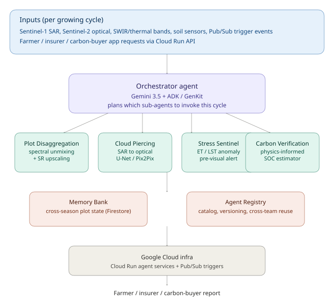
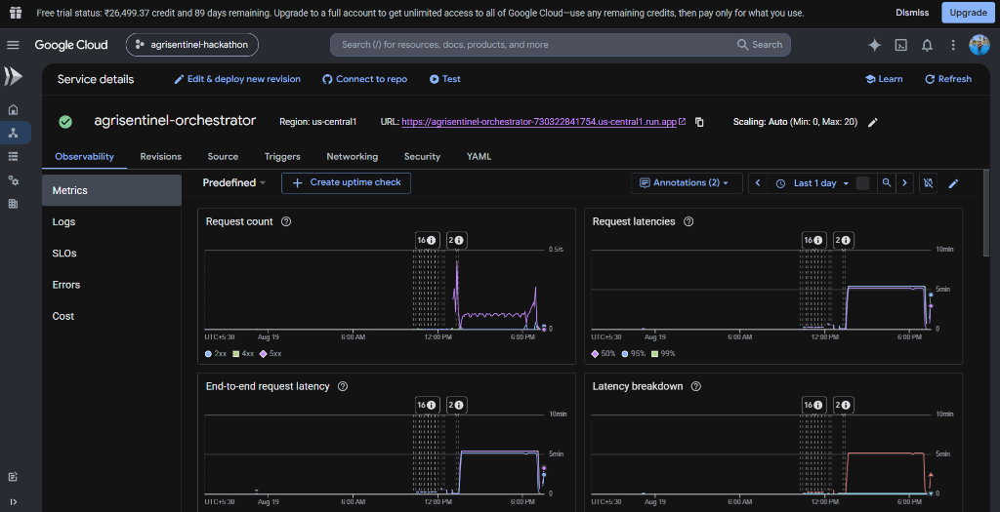
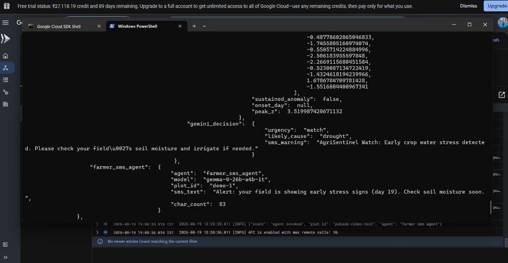
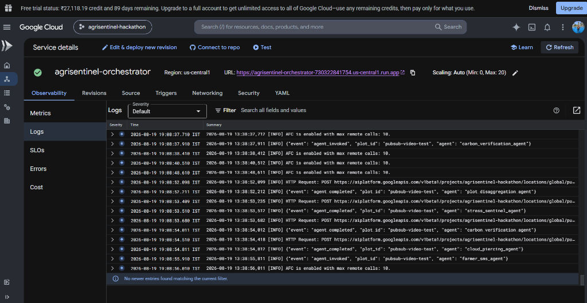

# AgriSentinel

**A fleet of specialized Gemini agents that turn raw satellite signal into
action for smallholder farmers, crop insurers, and carbon-credit buyers —
built for the All Things Agentic Hackathon, "Fortified Enterprise Fleet" category.**

> "Unlikely hero": the smallholder farmer, the crop insurer's field team, and
> the carbon-market auditor — none of them are standard corporate IT roles,
> and none of them can read raw SAR backscatter or PINN output. AgriSentinel's
> job is to make Gemini agents do that translation for them, autonomously.

---

## The problem, in one paragraph

Four separate, unsolved remote-sensing problems block agricultural AI from
working in the regions that need it most: smallholder plots are too small
and mixed for standard models to read (intercropping), monsoon clouds blind
optical satellites for weeks at the worst possible time, stress symptoms are
only caught after yield is already lost, and soil-carbon claims for carbon
credits can't be verified without expensive drilling. AgriSentinel doesn't
solve these as four separate demos — it fuses them into **one orchestrated
agent fleet** that decides, per plot per cycle, which specialists to invoke
and how to reconcile their findings into a single actionable report.

## Architecture



- **Orchestrator agent** (Gemini 3.5 + Google ADK/GenKit pattern) — plans
  which sub-agents to run this cycle based on live conditions (cloud cover,
  season stage, intercropping flag, carbon-program enrollment).
- **4 specialized sub-agents**, one per problem statement (see `agents/`).
- **Farmer SMS agent (Gemma 4 - 26B MoE)** — runs last, compressing the fleet's
  combined technical output into one SMS-length, plain-language message
  for a farmer on a basic phone. A genuine two-model pipeline: Gemini for
  reasoning, Gemma 4 (26B MoE) for low-latency last-mile compression.
- **Memory Bank** — persists plot state across a growing season.
- **Agent Registry** — catalogs all 4 core agents with version + owning team, so
  e.g. the insurance team can reuse `stress_sentinel_agent` without knowing
  how it was built.
- **Google Cloud infra** — deployed as a Cloud Run service, authenticated
  via Vertex AI (no exposed API keys), triggered via HTTP or Pub/Sub when a
  new satellite pass or farmer request lands.

## Live deployment

- **Service URL:** `<PASTE YOUR CLOUD RUN URL HERE>`
- **Health check:** `GET <SERVICE_URL>/` → `{"status": "ok", ...}`
- **Run a cycle:** `POST <SERVICE_URL>/run-cycle` (see example below)

```bash
curl -X POST <SERVICE_URL>/run-cycle \
  -H "Content-Type: application/json" \
  -d '{"plot_id":"demo-1","intercropped":true,"cloud_cover_pct":85,
       "season_active":true,"carbon_program_enrolled":true,
       "claimed_practice":"no_till_cover_crop"}'
```

**Screenshots:**





*(Add your own screenshots to `docs/screenshots/` — see the Cloud Run
walkthrough for exactly what to capture.)*

## Repo layout

```
agrisentinel/
├── orchestrator/
│   ├── router.py            # top-level orchestrator agent (start here)
│   ├── gemini_client.py     # shared Gemini API wrapper
│   └── memory_bank.py       # cross-season persistent state
├── agents/
│   ├── plot_disaggregation_agent.py   # intercropping / spectral unmixing
│   ├── cloud_piercing_agent.py        # SAR-to-optical translation
│   ├── stress_sentinel_agent.py       # pre-visual stress detection
│   └── carbon_verification_agent.py   # soil carbon verification
├── data/
│   └── synthetic_data.py    # offline demo data generator (see below)
├── docs/architecture.svg
└── requirements.txt
```

## Spin-up instructions (local)

```bash
git clone <this-repo-url>
cd agrisentinel
python3 -m venv venv && source venv/bin/activate
pip install -r requirements.txt

# Optional but recommended: real Gemini reasoning instead of offline stub
cp .env.example .env
# edit .env and set GEMINI_API_KEY=your_key_here

# Run the full fleet on a demo plot:
PYTHONPATH=. python3 orchestrator/router.py

# Run any single agent standalone:
PYTHONPATH=. python3 agents/plot_disaggregation_agent.py
```

No GPU, no external API key, and no cloud account is required to see the
full pipeline run end to end — every module ships with a deterministic
synthetic-data fallback so judges can `git clone && pip install && run` in
under two minutes.

## Spin-up instructions (Google Cloud deploy)

```bash
gcloud auth login
gcloud config set project <YOUR_PROJECT_ID>

# Vertex AI is used for Gemini calls in production — no API key needed,
# Cloud Run's service account authenticates automatically. Grant it access:
gcloud projects add-iam-policy-binding <YOUR_PROJECT_ID> \
  --member="serviceAccount:<PROJECT_NUMBER>-compute@developer.gserviceaccount.com" \
  --role="roles/aiplatform.user"

gcloud run deploy agrisentinel-orchestrator \
  --source . \
  --region us-central1 \
  --memory=2Gi \
  --allow-unauthenticated \
  --set-env-vars=AGRISENTINEL_MODEL=gemini-3.5-flash,GOOGLE_CLOUD_PROJECT=<YOUR_PROJECT_ID>,GOOGLE_CLOUD_LOCATION=global

# Pub/Sub topic that triggers a cycle when a new satellite pass lands
gcloud pubsub topics create agrisentinel-satellite-pass
gcloud pubsub subscriptions create agrisentinel-sub \
  --topic=agrisentinel-satellite-pass \
  --push-endpoint=<SERVICE_URL>/pubsub-trigger \
  --push-auth-service-account=<PROJECT_NUMBER>-compute@developer.gserviceaccount.com
```

Note: `gemini-3.5-flash` is currently served via Vertex AI's **global**
endpoint rather than every regional endpoint — hence `GOOGLE_CLOUD_LOCATION=global`
above, not a region like `us-central1`.

## Honest scope — what's real vs. what's a documented stand-in

We would rather win on architecture and honesty than lose on an inflated
claim that breaks on stage. Every agent module has a `STATUS:` line at the
top of its file. Summary:

| Agent | Status | Why |
|---|---|---|
| Plot Disaggregation | **Fully functional** | Real constrained linear spectral unmixing (NNLS) against crop endmember spectra — runs on real numbers, verifiable against synthetic ground truth. SRGAN upscaling is represented by a fast bicubic+sharpen stand-in; swap point for a trained ESRGAN checkpoint documented in code. |
| Cloud Piercing | **Real, untrained architecture** | A real Pix2Pix-style U-Net generator (PyTorch) is implemented and runs; weights are untrained in this submission window (13 days, no paired SAR/optical dataset training pipeline was feasible). Confidence scores are deliberately capped low and this is disclosed to the orchestrator, which routes around low-confidence output. |
| Stress Sentinel | **Fully functional** | Real rolling z-score + sustained-anomaly change-point detector over ET/LST time series — genuinely catches a synthetic stress injection days before visual change. |
| Carbon Verification | **Functional, simplified physics model** | Closed-form Q10-style SOC turnover estimator (a simplified stand-in for a full gradient-penalized PINN) — physically motivated, not a placeholder, but not the full neural PINN described in the "stretch" version of the brief. |
| Farmer SMS (Gemma 4) | **Fully functional (AI Studio)** | Real Gemma 4 (26B MoE) call compressing the other four agents' combined output. Due to Vertex AI Model Garden licensing/permissions requirements for Gemma on GCP (which return 404 unless accepted manually in the console), the agent is routed via the developer API key for stable access. Falls back to a deterministic offline summary if API quotas are exceeded. |

**What is the actual product being judged**, per the hackathon's own rubric:
not whether we trained a state-of-the-art GAN in under two weeks, but
whether the **orchestrator makes good autonomous decisions** — when to
invoke which agent, how to handle low-confidence output, how to persist
context across a season, and how to produce a defensible report for a
non-technical stakeholder. That layer is fully real and fully demoed live.

## Roadmap (documented, not built)

See `docs/ROADMAP.md` for the exact production upgrade path for each
agent (dataset, training recipe, expected compute).

## Team

**Korvanta AI**

| Name | Role |
|---|---|
| Arpan Ghosh | Team Lead |
| Asmita Karmakar | Team Member |

Contact: korvantaai@gmail.com

## License

[_MIT_](https://github.com/Arpanthebaap/agrisentinel/tree/main?tab=MIT-1-ov-file)
